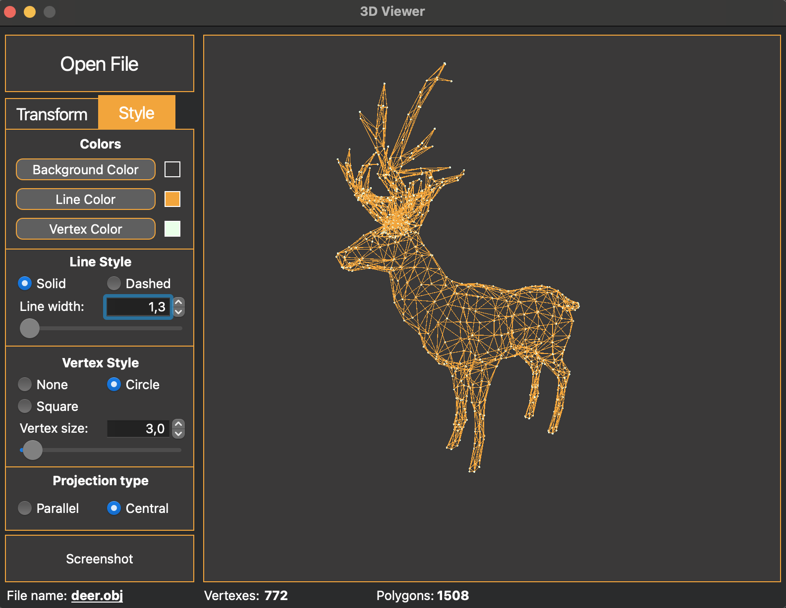

## Introduction

Implementation of a program to view 3D wireframe models (3D Viewer) in the C programming language. The models themselves are loaded from .obj files and can be viewable on the screen with the ability to rotate, scale and translate.


## Build
#### Prerequisites
- gcc compiler
- check.h library
- lcov
- cmake
- qt 6.5.0 (and higher)
- doxygen

#### Building
```
git clone https://github.com/vlasashk/3DViewer_V1.0.git
cd 3DViewer_V1.0/src/
make
```
#### Running
```
make execute
```
or navigate to newely created `build` directory inside `src` and double click 3DViewer_V1.0.app
#### Tests coverage report (lcov)
```
make gcov_report
```
#### Generate documentation (doxygen)
```
make dvi
```
## Project information
### Implementation
- Backend C: Functions for parsing and affine transformations
- QTCreator for GUI
- Doxygen to generate documentation
- OpenGL for rendering models

### Features

A wireframe model is a model of an object in 3D graphics, which is a set of vertices and edges that defines the shape of the displayed polyhedral object in three-dimensional space.
Features:
- Customizing the background color
- Customizing the color, thickness and type of the edges
- Customizing the type of projection (parallel and central)
- Customizing display shape, color and size of the vertices
- Saving settings between program restart

     
